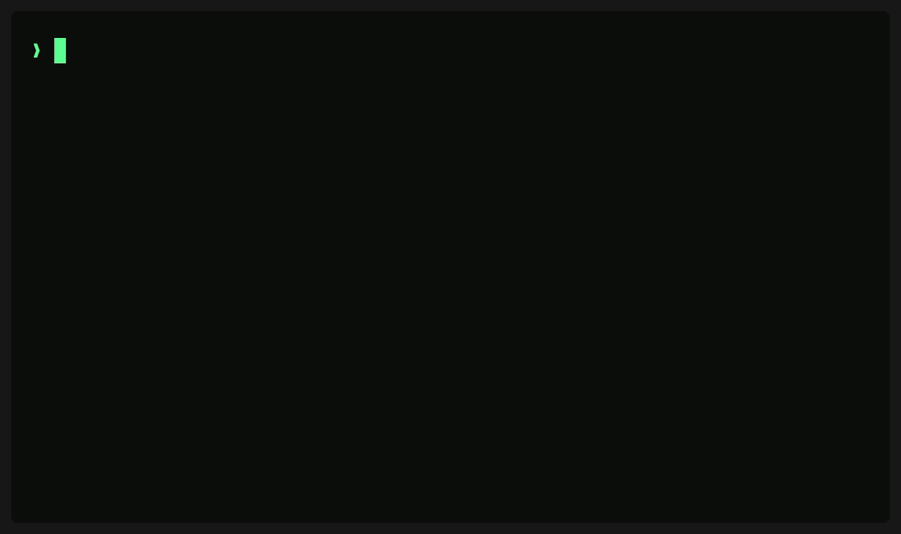

# memory-agent

<p align="center">
  
</p>

Your coding agent forgets everything between sessions. The history is all there on disk - hundreds of transcripts where you explained your stack, your ports, your decisions. Nobody reads it.

memory-agent reads it. It compiles your AI conversation history into a knowledge base of plain markdown notes, keeps it fresh in the background, and hands it to your agent when a session starts. Open a fresh session, ask "what do you know about me", get a real answer.

## Install

One command:

```bash
curl -fsSL https://raw.githubusercontent.com/noreff/memory-agent/main/install.sh | sh
```

Already in Claude Code? Same result without leaving it:

```
/plugin marketplace add noreff/memory-agent
/plugin install memory-agent@memory-agent
```

Then say `/memory-setup`. The agent shows you what it would remember from your last session, asks three questions, finds your history with your consent and backfills it. First results arrive in minutes. That is the last mechanical thing you do here - everything after it is conversation.

Requirements: Python 3.10+ (stdlib only) and Claude Code. A local model server is optional and nothing new to install - the system auto-discovers whatever OpenAI-compatible server you already run (LM Studio, Ollama, llama.cpp, Jan, ...) and reuses a model you already have loaded, so extraction is free and transcripts never leave your machine with no re-download. With no local server, extraction transparently uses your Claude plan. The backend is detected per run, nothing to configure.

For always-on background extraction, Ollama is the easy pick (it runs as a service and survives reboots); if you already use LM Studio, just keep it open. `mem.py status` shows the discovered server and model, or what extraction will fall back to.

## Why markdown files

- Every fact carries `sources` (the sessions it came from) and `conflicts` (what the note used to say, dated). Memory with receipts.
- Your memory is yours to read, grep, edit and version. Wrong fact? Edit the note.
- No vector DB, no daemon, no server. Retrieval is an index file the model reads, which holds up fine at personal scale - a few hundred notes.
- A new topic needs 3+ independent facts before it earns a note. No one-fact stubs.
- Injected memory is stripped before extraction, so the system never re-memorizes its own output.
- Contradictions resolve by recency and the losing fact stays in the log. Nothing is silently overwritten.

## How it works

```
capture  notice new transcripts              -> state/inbox/          no model, just file diffs
refresh  inbox -> distill -> extract atoms   -> state/derived/atoms   cheap model, local-friendly
merge    route atoms into notes, re-write    -> knowledge/            strong model
         only the touched ones
inject   knowledge/ -> into a new session                             read-only
```

Two speeds on purpose. Extraction is high-volume and low-judgment, so a free local model handles it. Consolidation needs judgment - deciding which note a fact belongs to, what it supersedes - so a strong model handles that, a few calls a day. Note frontmatter is always built by code, never by the model.

Atoms are routed against the existing knowledge base: into an existing note, to a gated new topic, or out as a duplicate. Merges apply automatically with timestamped backups (`merge.autoPromote: false` if you want a review gate instead). A periodic full recompile stays available as the deep clean.

## Backfill your history

This is the main event. Point the backfill at everything you have - Claude Code transcripts, a ChatGPT export, old machine dumps, random docs. Agents figure out each format, chunk it, extract atoms, dedupe globally and write canonical notes. Raw files are never modified.

From a Claude Code session:

```
Workflow -> { scriptPath: "<ROOT>/engine/backfill.js",
              args: { rawDir: "/path/to/raw", derivedDir: "<ROOT>/state/derived",
                      maxChunks: 400, model: "sonnet" } }
```

then

```bash
python3 mem.py adopt   # derived notes -> knowledge/ + index
```

Reference run: 103 sessions became 6,419 atoms and 33 notes in 47 minutes. Format hints live in `input/handlers/` - there is one for Claude Code transcripts and one for ChatGPT exports.

## CLI

```
python3 mem.py status      paths, discovered local server + model, detected backend, queue depth
python3 mem.py probe-local print the discovered local server + model (exit 0), or where it looked (exit 1)
python3 mem.py capture     scan for new sessions (first run baselines, nothing floods)
python3 mem.py refresh     extract atoms from queued sessions
python3 mem.py merge       consolidate atoms into notes
python3 mem.py adopt       promote backfill output into the live KB
python3 mem.py inject      print what a new session would receive
python3 mem.py eval        score your memory against your own gold set
```

And a read-only viewer over the KB (color auto-disables when piped; `--plain` to force off):

```
python3 mem.py view          dashboard: note types, coverage, freshness, pipeline depth
python3 mem.py view NOTE     one rendered note (fuzzy slug is fine: `view caching` works)
python3 mem.py find QUERY    full-text search with highlighted matches
python3 mem.py why NOTE      receipts: every atom's claim + verbatim evidence quote + source session
python3 mem.py conflicts     the supersede log across the KB — what memory used to believe
python3 mem.py log           what memory learned, newest first
python3 mem.py list          all notes as a table (--type, --sort updated|sources|conflicts|atoms)
```

`refresh` and `merge` are batched, locked against concurrent runs, and safe to fire from cron. The `/memory-refresh` command wraps the whole cycle and replies in one line.

## Config

```jsonc
{
  "agents": [
    { "adapter": "claude-code", "enabled": true },
    { "adapter": "generic", "name": "my-tool", "enabled": false,
      "transcripts": { "dir": "~/.my-tool/logs", "format": "auto" },
      "inject": { "file": "~/.my-tool/memory.md" } }
  ],
  "merge": { "autoPromote": true, "newNoteThreshold": 3 },
  "model": {
    "extract": { "backend": "auto",
                 "models": { "local": "qwen/qwen3.6-35b-a3b", "subscription": "haiku" } },
    "route":   { "backend": "subscription", "model": "sonnet" },
    "merge":   { "backend": "subscription", "model": "sonnet" }
  }
}
```

`agents` is a list - several tools can feed one knowledge base, and any tool you can point at a folder works through the generic adapter with zero code. Plugin installs override config by dropping a `config.json` into the plugin data dir, which survives updates.

## Eval

`mem.py eval` scores three things against a gold set you write yourself (`eval/` is git-ignored, it is personal data): recall (re-extract frozen fixtures, do known facts come back), lookup (pick the right note from the index, answer from its body), inject (what is answerable from the index alone). Every run appends to `eval/history.jsonl`, so a prompt or model change shows up as a score delta instead of a feeling.

## Security model

Memory built from conversations is an injection surface. The defenses are structural: the knowledge base is only written by code, from staged artifacts, after a gate. Note frontmatter is built in code. Atom payloads are fenced as untrusted data in every prompt. The system's own model calls are sentinel-tagged so they can never be re-memorized. Raw transcripts are read-only.

Residual risk: consolidation agents run with your host's tool permissions, so check your platform's sandboxing if you process transcripts you don't trust. Promoted notes get injected into future sessions - treat `knowledge/` like you treat CLAUDE.md.

The background extractor never uses your Claude plan. It runs local-only, and if no local server is up it just queues work for your next in-session run.

## Layout

```
core/        config, on-disk pipeline contract, prompt rubrics
input/       format handlers + the mechanical chunker
adapters/
  agent/     claude_code (hooks, commands, launchd), generic (any tool)
  model/     local (any OpenAI-compatible server, auto-discovered), cloud (API), subscription (claude CLI), stub
engine/      capture, refresh, merge, backfill.js, evals, inject
tests/       python3 -m unittest discover tests
mem.py       the CLI        install.py  hooks + commands + macOS collector
```

MIT. Built on a Mac, runs on anything with Python; the launchd collector is macOS-only (Linux: cron `mem.py capture && mem.py refresh`).
